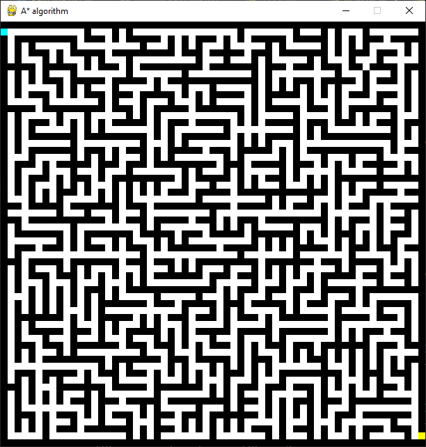

# A* Algorithm
This is a Python implementation of the A* algorithm, a popular pathfinding algorithm that can be used to find the shortest path between two points in a maze.

## Screenshots

<div style="display:flex;justify-content:space-evenly;">


</div>

## Run Locally

Clone the project

```bash
  git clone https://github.com/Toukoms/a_star_algorithm.git
```

Go to the project directory

```bash
  cd a_star_algorithm
```

Install requirements

```bash
pip install -r requirements.txt
```

Visualize A* algorithm

```bash
python main.py
```

## Acknowledgments

- [Wikipedia article on A* search algorithm](https://en.wikipedia.org/wiki/A*_search_algorithm)
